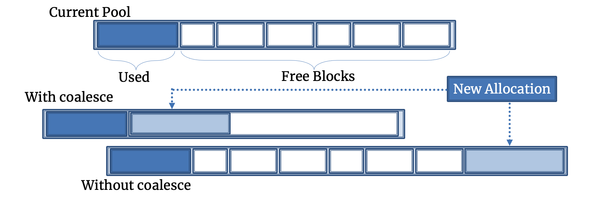

.. _coalesce_pool:

======================
Coalescing Pool Memory
======================

Umpire's memory pools provide a more performant way to allocate large
amounts of memory with fewer calls to the underlying API. 
Memory pools allocate and manage a pool of large memory blocks.  When application
allocations are requested, the memory pool allocator will service the allocation from
these memory blocks rather than making (many) allocation requests of the underlying API
which can ...
at once instead of making multiple, smaller memory allocations which can 
become quite expensive. However, the performance of memory pools 
varies widely depending upon how the memory blocks within the pool are managed.
Each application allocation within a memory pool must fit within a `memory block`.
As memory is allocated and deallocated, those blocks must be properly 
adjusted in order to handle new, incoming memory allocations.

Umpire's solution for managing blocks of memory within a pool is to use a
`coalescing function`. The coalescing function will deallocate a certain amount
of unused memory and reallocate it, creating a new memory block which can handle new allocations.
When Umpire is unable to find a block with sufficient memory for the applications' allocation
request, it will allocate a new block from the allocation resource and add that block to the pool.
As application memory use grows, the pool will fill up with many blocks.  Umpire has a `coalescing function` that will deallocate all of the unused (free) blocks in its pool and then reallocate a single block of memory that is large enough to contain all of the freed blocks.
The figure below attempts to describe how a particular pool ("Current Pool") 
will handle a new incoming allocation into the pool with and without coalescing.

.. note::
   Some helpful hints: The entire size of the "Current Pool" depicted above
   is also known as the "actual_size". Note how the actual size grows or does
   not grow when there is or is not a coalesce. The "Used" portion depicted
   within the "Current Pool" is also referred to as the "current_size". The
   "actual_size" and the "current_size" may differ a lot in practice. Lastly,
   the first depiction of the "Current Pool" has a "high_watermark" size
   which is equal to the "current_size". However, the "high_watermark" size
   will grow more or less according to the new value of "current_size".

As depicted, if the memory pool can coalesce, it will deallocate those "free" (i.e. unused) blocks
of memory and reallocate one, larger memory block that can handle the new allocation.
Otherwise, if the pool can't coalesce, it will need to grow to accomodate the new allocation.
In this particular example, the free blocks are all too small to handle the new
allocation, so they can't be reused to accomodate that new chunk of memory until a
coalesce has happened. If the pool can't coalesce as much as it needs to, it can
grow too big and prematurely run out of memory.

In Umpire, the QuickPool memory pool (:class:`umpire::strategy::QuickPool`) provides a coalescing
function (:func:`umpire::strategy::QuickPool::coalesce`) that can be used to release
unused memory and allocate a single large block that will be able to satisfy
allocations up to the previously observed high-watermark. 

To call this
function, you must get the pointer to the
:class:`umpire::strategy::AllocationStrategy` from the
:class:`umpire::Allocator`:

.. literalinclude:: ../../../examples/cookbook/recipe_coalesce_pool.cpp
   :start-after: _sphinx_tag_tut_unwrap_strategy_start
   :end-before: _sphinx_tag_tut_unwrap_strategy_end
   :language: C++

Once you have the pointer to the appropriate strategy, you can call the
function:

.. literalinclude:: ../../../examples/cookbook/recipe_coalesce_pool.cpp
   :start-after: _sphinx_tag_tut_call_coalesce_start
   :end-before: _sphinx_tag_tut_call_coalesce_end
   :language: C++

The complete example is included at the bottom of this page.

Coalescing a Pool Automatically
===============================

Wouldn't it be great if we didn't have to make sure we called the coalescing function 
manually every time? Well, we don't! Umpire provides coalescing heuristics which are supposed 
to determine when to coalesce and with how many bytes.

Users can create their own coalescing heuristic function or they can rely on the heuristics
that Umpire provides. Umpire provides two heuristic functions: Blocks-Releasable and 
Percent-Releasable. The Blocks-Releasable heuristic is passed an integer value for the 
number of blocks that should be deemed "releasable" before coalescing. Similarly, the
Percent-Releasable heuristic is passed an integer value for the percent of bytes that
should be "releasable" before coalescing.

More information about how to use these functions can be found in the Doxygen references. 
There is also an example of using the coalescing heuristic to improve DynamicPool performance `here <https://umpire.readthedocs.io/en/task-um-1018-add-hwm-coalesce-funcs/sphinx/cookbook/dynamic_pool_heuristics.html>`_.

.. literalinclude:: ../../../examples/cookbook/recipe_coalesce_pool.cpp
