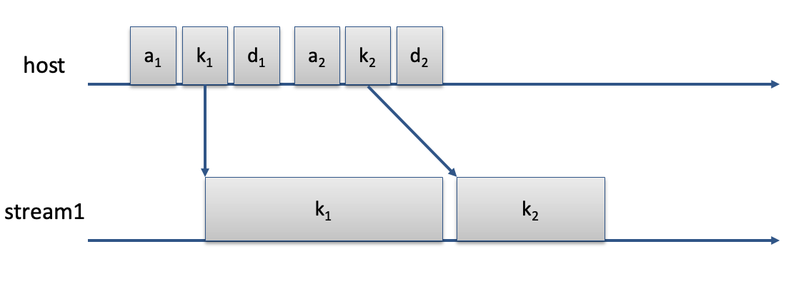
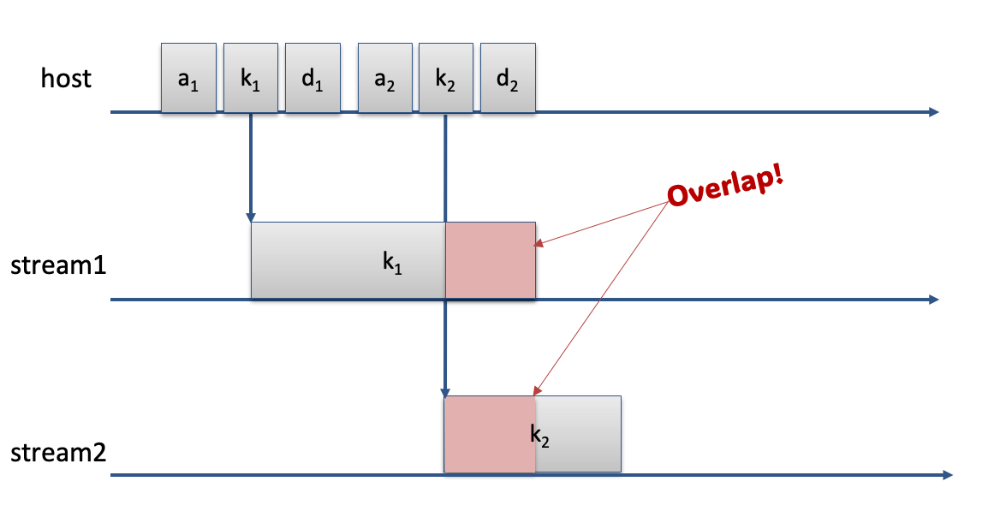
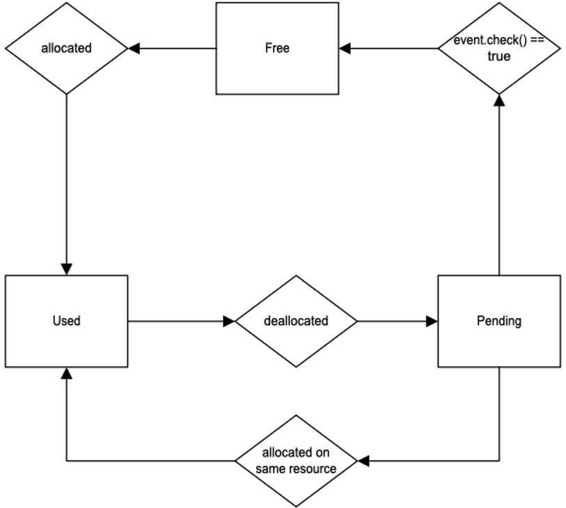

.. _resource_aware_pool:

=============================
Creating a Resource Aware Pool
=============================

Umpire uses `Camp <https://github.com/LLNL/camp>`_ resources to keep track of "streams of execution". A single "stream of execution" 
on the device corresponds to a single Camp device resource (e.g. a single cuda stream). 
Similarly, when we are executing on the host, this
corresponds to a separate "stream of execution" and therefore a separate Camp host resource. 

Typically, we deal with multiple Camp resources with a single resource for the host and 
one or more for the device, depending on how many (cuda, hip, etc.) streams we have in use. 
While we can have multiple camp resources for the device (e.g. multiple cuda streams), 
we can only have one resource for the host since the host only has one stream of execution. 
Since we are dealing with Camp resources, we call this pool strategy the ``ResourceAwarePool``.

Throughout the rest of this documentation page, we will use a "camp resource" to refer to a "stream of
execution". If the camp resource is on the device, then we are referring to a device stream such 
as a cuda stream or hip stream.

Umpire's strategies such as ``QuickPool`` and ``DynamicPoolList`` work very well
on the device when we are dealing with a single camp device resource. In the figure below, we have
the host resource which allocates memory (a1), uses the memory in a kernel (k1), then schedules
a deallocate (d1). Then, the host immidiately reuses that memory for a different kernel (k2).

In this scenario, there is no potential for a data race, since we are dealing with just one cuda stream
and kernels on a single stream happen sequentially. In other words, this scenario deals with only
one Camp device resource. However, when dealing with multiple camp device resources
there is a possibility for a data race if we allocate, use, and 
schedule a deallocation on one stream and then try to reuse that memory immediately on another stream. 
The figure below depicts that scenario. Note that the overlap in the kernels corresponds to a potential
data race.

Umpire's ``ResourceAwarePool`` is designed to avoid any potential data races by making the resources
"aware" of the memory used by another resource. If resource ``r2`` needs to allocate memory, but that
memory is potentially still being used by another resource, ``r1``,  then ``r2``  will use different 
memory instead. To do that, the ``ResourceAwarePool`` introduces a "pending" state. As soon as ``r1``
schedules a deallocation, that memory is marked as pending. When ``r2`` needs to reallocate that
memory, it will first check to see if the memory is still pending. If it is NOT pending, it will
reuse that memory, otherwise it will use a different piece of memory instead.

The figure below illustrates the 3 states of a ``ResourceAwarePool``: free, used, and pending.

Note that if you schedule a deallocate, but then try to reuse that memory on the SAME
resource, that memory will NOT be labeled pending. It is only when we have scheduled a deallocate
on one resource and then try to reuse that same memory on a different resource that we have
the potential for a data race and thus the need for the pending state.

In this example, we will review how to use the :class:`umpire::strategy::ResourceAwarePool`
strategy. You can create a ``ResourceAwarePool`` with the following code:

.. code-block:: bash

   auto& rm = umpire::ResourceManager::getInstance();
   auto pool = rm.makeAllocator<umpire::strategy::ResourceAwarePool>("rap-pool", rm.getAllocator("UM"));
   
Next, you will want to create camp resources. We use these camp resources to track events
on the resource. Below is an example of creating a camp resource for two device streams.

.. code-block:: bash

   using namespace camp::resources;
   ...
   Cuda d1, d2; //create Cuda resources, d1 for stream1, d2 for stream2
   Host h1; //create a Host resource
   Resource r1{d1}, r2{d2}, r3{h1}; //Initialize the Camp resources

Then, to allocate memory with your ``ResourceAwarePool`` you can do the following:

.. code-block:: bash

   double* a = static_cast<double*>(pool.allocate(r1, NUM_THREADS * sizeof(double)));

When we allocate memory that we intend to use in a kernel launched with the resource, we
now have to send that resource (``r1``) to the allocate function of the ``ResourceAwarePool``.
Be sure to launch the kernel using the correct stream. For example:

.. code-block:: bash

   my_kernel<<NUM_BLOCKS, BLOCK_SIZE, 0, d1.get_stream()>>>(a, NUM_THREADS);

In the kernel launch above, we are specifying the stream from the Cuda resource we created above.
To deallocate, use the following code:

.. code-block:: bash

   pool.deallocate(r1, a); //This might change...

Assuming you reallocated memory on ``a`` with ``r2``, you could then launch a second kernel on the second stream. For example:

.. code-block:: bash

   my_other_kernel<<NUM_BLOCKS, BLOCK_SIZE, 0, d2.get_stream()>>>(a, NUM_THREADS);

The ``ResourceAwarePool`` will also be useful for avoiding data races in a single memory space. In the case of a single
memory space, just having two or more camp resources, whether host or device, will give us the potential for data races
since memory can be visible by both host and device.

A full example of using the ``ResourceAwarePool`` can be seen below:

.. literalinclude:: ../../../examples/rap_test.cpp
